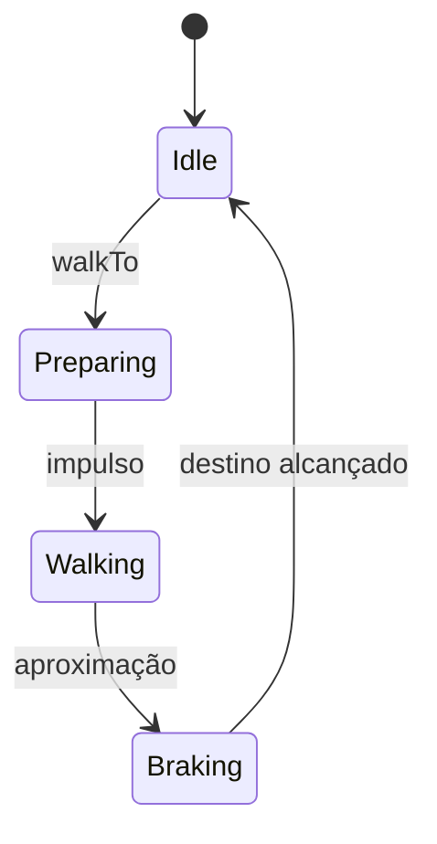

# Guia técnico e didático — Smart Mascots Lab

## 1. Objetivo deste documento

Este guia explica o Smart Mascots Lab em camadas. Uma pessoa iniciante pode
seguir a instalação, entender os conceitos e realizar testes. Uma pessoa
experiente pode consultar arquitetura, estados, responsabilidades,
invariantes e pontos de evolução.

O laboratório é um projeto separado do tema Tray. Isso permite experimentar
sem alterar o e-commerce em produção.

## 2. Visão do produto

Os mascotes da Smart Eletro Vini não devem funcionar apenas como imagens
decorativas. Eles poderão:

- apresentar produtos;
- orientar clientes;
- reagir a interações;
- conectar o e-commerce, o curso gratuito e a plataforma de locação;
- executar pequenas cenas sem prejudicar a navegação.

O personagem usado nos protótipos é o **Byte**, especialista em computadores
e personagem principal da marca.

### 2.1 Por que a aparência é provisória?

Uma animação bonita depende de ritmo, peso, antecipação e transições. Se a
arte definitiva fosse produzida antes de o movimento estar validado, cada
ajuste exigiria redesenhar vários quadros.

Por isso, a ordem adotada é:

1. validar comportamento;
2. validar estados e controles;
3. validar desempenho e acessibilidade;
4. produzir o spritesheet definitivo;
5. integrar ao e-commerce.

## 3. Tecnologias

| Tecnologia | Responsabilidade |
|---|---|
| HTML | Estrutura semântica da interface |
| CSS | Aparência, layout responsivo e Byte provisório |
| TypeScript | Regras, eventos, tipos e integração entre interface e motor |
| GSAP | Timelines, easing, sincronização e controle dos movimentos |
| Vite | Servidor local, atualização rápida e build |

### 3.1 Por que GSAP?

Animações CSS são adequadas para ciclos simples. O Byte precisa coordenar
várias partes, controlar o tempo e interromper uma ação para iniciar outra.

O GSAP fornece:

- timelines compostas;
- controle de pausa, reinício, progresso e velocidade;
- posicionamento relativo entre movimentos;
- funções de easing;
- cancelamento seguro de tweens;
- animação de propriedades de transformação com boa compatibilidade.

### 3.2 Por que ainda não usamos PixiJS ou Phaser?

O personagem atual é composto por elementos DOM. GSAP é suficiente e mantém
o laboratório pequeno.

PixiJS poderá entrar quando o Byte definitivo utilizar spritesheets e Canvas.
Phaser só deve ser considerado se a experiência evoluir para algo semelhante
a um jogo, com cenas, colisões e física.

## 4. Estrutura do repositório

```text
smart-mascots-lab/
├── docs/
│   └── TECHNICAL_GUIDE.md
├── public/
├── src/
│   ├── main.ts
│   ├── motion-engine.ts
│   └── style.css
├── AI_CONTEXT.md
├── README.md
├── index.html
├── package.json
├── package-lock.json
└── tsconfig.json
```

Arquivos remanescentes do template inicial do Vite podem ser removidos em uma
limpeza futura, depois que confirmarmos que nenhum deles é usado.

## 5. Instalação explicada

### 5.1 Verificar o ambiente

No PowerShell:

```powershell
node --version
npm --version
git --version
```

Cada comando deve exibir uma versão.

### 5.2 Clonar e selecionar o protótipo

```powershell
git clone https://github.com/ViniciusSilva97/smart-mascots-lab.git
cd smart-mascots-lab
git switch feature/locomotion-engine
```

O `git switch` escolhe a branch do Protótipo 03. Ela já contém os Protótipos
01 e 02 em seu histórico.

### 5.3 Instalar e iniciar

```powershell
npm install
npm run dev
```

`npm install` lê `package.json` e `package-lock.json`. O primeiro declara as
dependências; o segundo fixa as versões resolvidas para que instalações
diferentes sejam reproduzíveis.

### 5.4 Parar o servidor

No terminal em que o Vite está executando:

```text
Ctrl + C
```

## 6. Como a aplicação inicia

O navegador carrega `index.html`. Esse arquivo contém o elemento:

```html
<div id="app"></div>
```

Depois, `src/main.ts`:

1. importa o CSS;
2. importa o motor;
3. cria a interface dentro de `#app`;
4. localiza os elementos necessários;
5. instancia `ByteMotionEngine`;
6. registra botões, teclado, clique e redimensionamento.

Essa separação permite trocar a interface sem reescrever as animações.

## 7. Responsabilidades de `main.ts`

`main.ts` é a camada de apresentação e interação.

Ele deve:

- construir ou conectar a interface;
- converter ações do usuário em comandos do motor;
- mostrar estados e progresso;
- calcular a posição do clique no palco;
- adaptar os limites quando a janela muda.

Ele não deve:

- conter detalhes de cada passo da caminhada;
- manipular diretamente todos os braços e pernas;
- definir regras internas da timeline;
- armazenar a posição oficial do personagem.

### 7.1 Conversão do clique em destino

O clique do navegador usa coordenadas da janela. O motor trabalha com uma
posição relativa ao centro do palco.

Conceitualmente:

```text
posição no palco = clique horizontal - borda esquerda do palco
destino do motor = posição no palco - metade da largura do palco
```

O destino ainda é limitado por uma margem, evitando que o personagem saia da
área visível.

## 8. Responsabilidades de `ByteMotionEngine`

`ByteMotionEngine`, em `src/motion-engine.ts`, concentra o comportamento.

### 8.1 Elementos controlados

- `wrap`: posição global no palco;
- `byte`: corpo completo e direção;
- `head`: inclinação da cabeça;
- `antenna`: reação secundária;
- `eyes`: piscar e direção do olhar;
- `smile`: referência para expressões futuras;
- `arms`: balanço e gestos;
- `legs`: ciclo dos passos.

### 8.2 Estado interno

| Campo | Significado |
|---|---|
| `timeline` | Timeline atualmente controlada |
| `speed` | Multiplicador de velocidade |
| `positionX` | Posição horizontal persistente |
| `direction` | Direção atual: `-1` ou `1` |
| `maxPosition` | Limite horizontal responsivo |

`positionX` é a fonte de verdade para a localização do Byte. Depois de
caminhar, o personagem deve continuar no destino, inclusive ao iniciar um
gesto.

## 9. Movimento, estado e pose

Esses três conceitos não são iguais.

### 9.1 Movimento

É uma ação reconhecida pela interface:

```typescript
type Motion = 'idle' | 'walk' | 'point' | 'think' | 'celebrate'
```

### 9.2 Estado de locomoção

É a fase interna da caminhada:

```typescript
type LocomotionState =
  | 'idle'
  | 'preparing'
  | 'walking'
  | 'braking'
```

### 9.3 Pose

É o conjunto instantâneo de transformações: rotação dos braços, altura do
corpo, inclinação da cabeça e posição das pernas.

Uma caminhada contém várias poses e vários estados, mas é apresentada ao
usuário como um único movimento.

## 10. Máquina de estados da locomoção



### 10.1 `idle`

O Byte respira, pisca e move discretamente a antena. O objetivo é evitar uma
pose completamente congelada.

### 10.2 `preparing`

O corpo abaixa e inclina antes de sair do lugar. Isso é antecipação: prepara
visualmente o observador para o deslocamento.

### 10.3 `walking`

O invólucro se desloca, enquanto membros e corpo executam ciclos paralelos.
A duração depende da distância.

### 10.4 `braking`

O Byte ultrapassa levemente o destino, retorna e absorve a parada. Essa
pequena compensação evita uma interrupção artificial.

## 11. Construção da caminhada

`createLocomotion` recebe:

```typescript
createLocomotion(fromX, targetX, running, settleToIdle)
```

### 11.1 Distância e duração

```text
distância = |destino - origem|
duração = distância / pixels por segundo
```

Corrida usa mais pixels por segundo e um ciclo de passada menor.

### 11.2 Repetições da passada

O número de repetições é calculado com base na duração da viagem. Isso evita
usar a mesma quantidade de passos para trajetos curtos e longos.

### 11.3 Movimentos paralelos

Durante o deslocamento:

- braços oscilam em oposição;
- pernas oscilam em oposição;
- corpo sobe e desce;
- corpo inclina na direção;
- `wrap` muda de posição.

Os marcadores relativos do GSAP, como `"<"`, iniciam ações em paralelo.

## 12. Substituição segura de timelines

Toda nova ação passa por `replaceTimeline`.

A ordem correta é:

1. matar a timeline antiga;
2. limpar tweens e pose antiga;
3. criar a nova timeline;
4. aplicar velocidade e callbacks;
5. iniciar.

### 12.1 Erro histórico importante

Na primeira versão do Protótipo 02, a nova timeline era criada antes da
limpeza. `gsap.killTweensOf` eliminava os tweens recém-criados e nenhum
movimento aparecia.

Não altere a ordem atual sem um teste específico. A fábrica recebida por
`replaceTimeline` existe para garantir que a criação aconteça depois da
limpeza.

## 13. Callbacks entre motor e interface

O motor não escreve diretamente nos painéis da página. Ele informa eventos:

- `onMotionChange`;
- `onLocomotionStateChange`;
- `onProgress`;
- `onPlayStateChange`.

Essa inversão reduz o acoplamento. Uma futura interface em Canvas, Tray ou
aplicativo poderá reutilizar conceitos do motor e apresentar os estados de
outra forma.

## 14. Responsabilidades de `style.css`

O CSS contém:

- identidade retro-tech;
- layout desktop, tablet e mobile;
- construção visual provisória do Byte;
- palco, grid e marcador de destino;
- estados de foco e hover;
- suporte a `prefers-reduced-motion`.

Transformações controladas pelo GSAP não devem ser duplicadas em animações
CSS sobre os mesmos elementos. Duas fontes tentando escrever `transform`
podem produzir saltos e resultados imprevisíveis.

## 15. Controles e testes manuais

### 15.1 Teste funcional mínimo

1. Abra o laboratório.
2. Confirme que o Byte respira e pisca.
3. Clique à esquerda e à direita do palco.
4. Use `Shift + clique`.
5. Use as setas.
6. Pause no meio do deslocamento.
7. Continue.
8. Altere a velocidade.
9. Redimensione a janela.
10. Acione apontar, pensar e comemorar depois de caminhar.

### 15.2 Critérios de aprovação

- não volta ao centro sem comando;
- não sai do palco;
- vira para a direção correta;
- não teletransporta entre estados;
- a pausa congela a pose atual;
- o retorno preserva o destino;
- um novo comando interrompe o anterior sem deixar membros deformados;
- o build termina sem erros.

### 15.3 Build obrigatório

Antes de publicar:

```powershell
npm run build
```

O comando executa primeiro o compilador TypeScript e depois o build do Vite.

## 16. Problemas conhecidos e diagnóstico

### 16.1 `favicon.ico` retorna 404

O navegador pode tentar carregar automaticamente:

```text
http://localhost:5173/favicon.ico
```

Esse 404 é visualmente inofensivo e não bloqueia o motor. Uma futura versão
deve adicionar e referenciar o favicon oficial.

### 16.2 Página antiga depois de trocar a branch

Pare o servidor, confirme a branch e reinicie:

```powershell
git branch --show-current
npm install
npm run dev
```

No navegador, use `Ctrl + Shift + R`.

### 16.3 GSAP ausente

```powershell
npm list gsap
```

Se necessário:

```powershell
npm install
```

### 16.4 Movimento não acontece

Verifique o Console do navegador. Um 404 isolado de favicon não é a causa.
Erros em `motion-engine.ts`, importação do GSAP ou seletores nulos são
relevantes.

## 17. Acessibilidade

O laboratório já considera `prefers-reduced-motion` no CSS, mas a cobertura
do GSAP ainda precisa ser ampliada.

Antes da integração real, devemos:

- detectar a preferência no TypeScript;
- oferecer versão estática ou movimentos reduzidos;
- evitar flashes;
- manter controles acessíveis por teclado;
- não transformar movimento em requisito para comprar ou navegar;
- garantir nomes acessíveis para botões.

## 18. Desempenho

Boas práticas atuais:

- preferir `transform` e `opacity`;
- manter apenas uma timeline principal por personagem;
- cancelar ações antigas;
- limitar movimentos ao palco;
- preservar o projeto sem framework de interface pesado.

Antes da Tray:

- medir tamanho do bundle;
- testar aparelhos Android intermediários;
- testar várias instâncias;
- evitar carregar spritesheets fora da viewport;
- interromper animações quando a aba estiver oculta;
- verificar consumo de CPU e memória.

## 19. Estratégia de branches

Cada protótipo possui uma branch para comparação:

```text
main
└── feature/lab-foundation
    └── feature/gsap-motion-engine
        └── feature/locomotion-engine
```

Não é necessário mesclar uma branch anterior para testar a seguinte: cada
branch nova foi criada a partir da anterior.

## 20. Roadmap técnico

### Protótipo 04 — Salto

- antecipação;
- impulso;
- subida;
- ápice;
- queda;
- aterrissagem;
- recuperação.

### Protótipo 05 — Expressões

- direção do olhar;
- piscadas naturais;
- surpresa;
- curiosidade;
- confirmação;
- sincronização de cabeça, antena e fala.

### Protótipo 06 — Objetos

- aproximar-se;
- pegar;
- carregar;
- soltar;
- apontar para produto;
- reagir ao objeto.

### Protótipo 07 — Máquina completa

- prioridade de estados;
- fila e interrupção de ações;
- ações automáticas;
- reações a eventos;
- testes automatizados.

### Protótipo final

- Byte oficial;
- spritesheet;
- possível renderização PixiJS;
- otimização;
- integração controlada com Tray.

## 21. Diretrizes para contribuição

1. Trabalhe em uma branch derivada do protótipo mais recente.
2. Mantenha a aparência provisória enquanto o objetivo for movimento.
3. Não misture refatoração ampla com uma nova animação.
4. Preserve `positionX` como fonte de verdade.
5. Não recrie timelines antes da limpeza.
6. Execute o build.
7. Teste desktop e mobile.
8. Atualize este guia e `AI_CONTEXT.md` quando decisões mudarem.

## 22. Glossário

| Termo | Definição |
|---|---|
| Tween | Transição de uma propriedade entre valores |
| Timeline | Sequência coordenada de tweens e callbacks |
| Easing | Curva que controla aceleração e desaceleração |
| Pose | Estado visual instantâneo do personagem |
| Antecipação | Movimento preparatório que anuncia a ação |
| Follow-through | Continuação ou acomodação após a ação principal |
| Spritesheet | Imagem com vários quadros de animação |
| DOM | Estrutura de elementos da página |
| Canvas | Superfície gráfica controlada por código |
| Handoff | Contexto entregue para continuidade do trabalho |

