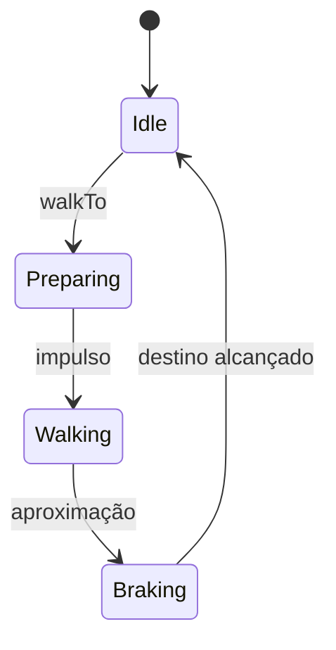
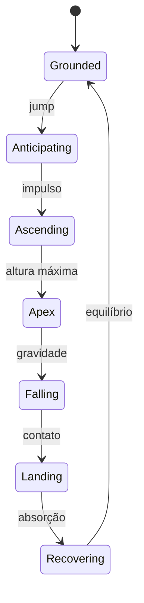
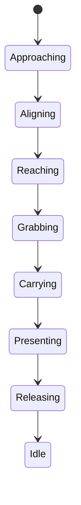

# Guia técnico e didático — Smart Mascots Lab

## 1. Objetivo deste documento

Este guia explica o Smart Mascots Lab em camadas. Uma pessoa iniciante pode
seguir a instalação, entender os conceitos e realizar testes. Uma pessoa
experiente pode consultar arquitetura, estados, responsabilidades,
invariantes e pontos de evolução.

O laboratório é um projeto separado do tema Tray. Isso permite experimentar
sem alterar o e-commerce em produção.

## 2. Visão do produto

Os mascotes da Smart Eletro Vini não devem funcionar apenas como imagens
decorativas. Eles poderão:

- apresentar produtos;
- orientar clientes;
- reagir a interações;
- conectar o e-commerce, o curso gratuito e a plataforma de locação;
- executar pequenas cenas sem prejudicar a navegação.

O personagem usado nos protótipos é o **Byte**, especialista em computadores
e personagem principal da marca.

### 2.1 Por que a aparência é provisória?

Uma animação bonita depende de ritmo, peso, antecipação e transições. Se a
arte definitiva fosse produzida antes de o movimento estar validado, cada
ajuste exigiria redesenhar vários quadros.

Por isso, a ordem adotada é:

1. validar comportamento;
2. validar estados e controles;
3. validar desempenho e acessibilidade;
4. produzir o spritesheet definitivo;
5. integrar ao e-commerce.

## 3. Tecnologias

| Tecnologia | Responsabilidade |
|---|---|
| HTML | Estrutura semântica da interface |
| CSS | Aparência, layout responsivo e Byte provisório |
| TypeScript | Regras, eventos, tipos e integração entre interface e motor |
| GSAP | Timelines, easing, sincronização e controle dos movimentos |
| Vite | Servidor local, atualização rápida e build |
| Vitest | Testes automatizados das regras de orquestração |
| Playwright | Testes de integração em Chromium real |
| GitHub Actions | Execução reproduzível dos testes de navegador |

### 3.1 Por que GSAP?

Animações CSS são adequadas para ciclos simples. O Byte precisa coordenar
várias partes, controlar o tempo e interromper uma ação para iniciar outra.

O GSAP fornece:

- timelines compostas;
- controle de pausa, reinício, progresso e velocidade;
- posicionamento relativo entre movimentos;
- funções de easing;
- cancelamento seguro de tweens;
- animação de propriedades de transformação com boa compatibilidade.

### 3.2 Por que ainda não usamos PixiJS ou Phaser?

O personagem atual é composto por elementos DOM. GSAP é suficiente e mantém
o laboratório pequeno.

PixiJS poderá entrar quando o Byte definitivo utilizar spritesheets e Canvas.
Phaser só deve ser considerado se a experiência evoluir para algo semelhante
a um jogo, com cenas, colisões e física.

## 4. Estrutura do repositório

```text
smart-mascots-lab/
├── .github/
│   └── workflows/
│       └── browser-tests.yml
├── docs/
│   └── TECHNICAL_GUIDE.md
├── public/
├── src/
│   ├── main.ts
│   ├── lab-app.ts
│   ├── motion-engine.ts
│   ├── performance-monitor.ts
│   ├── performance-monitor.test.ts
│   ├── state-orchestrator.ts
│   ├── state-orchestrator.test.ts
│   └── style.css
├── tests/
│   └── browser/
│       └── lab.spec.ts
├── AI_CONTEXT.md
├── playwright.config.ts
├── README.md
├── index.html
├── package.json
├── package-lock.json
└── tsconfig.json
```

Arquivos remanescentes do template inicial do Vite podem ser removidos em uma
limpeza futura, depois que confirmarmos que nenhum deles é usado.

## 5. Instalação explicada

### 5.1 Verificar o ambiente

No PowerShell:

```powershell
node --version
npm --version
git --version
```

Cada comando deve exibir uma versão.

### 5.2 Clonar e selecionar o protótipo

```powershell
git clone https://github.com/ViniciusSilva97/smart-mascots-lab.git
cd smart-mascots-lab
git switch feature/robustness-integration-tests
```

O `git switch` escolhe a branch do Protótipo 09. Ela já contém os protótipos
anteriores e a documentação em seu histórico.

### 5.3 Instalar e iniciar

```powershell
npm install
npm run dev
```

`npm install` lê `package.json` e `package-lock.json`. O primeiro declara as
dependências; o segundo fixa as versões resolvidas para que instalações
diferentes sejam reproduzíveis.

Para instalar o Chromium usado nos testes de integração:

```powershell
npx playwright install chromium
```

### 5.4 Parar o servidor

No terminal em que o Vite está executando:

```text
Ctrl + C
```

## 6. Como a aplicação inicia

O navegador carrega `index.html`. Esse arquivo contém o elemento:

```html
<div id="app"></div>
```

Depois, `src/main.ts`:

1. importa o CSS;
2. localiza o contêiner `#app`;
3. chama `createMascotLab` de `src/lab-app.ts`;
4. guarda a instância ativa;
5. oferece `mountLab()` e `destroyLab()` para controlar seu ciclo de vida;
6. desmonta a instância anterior durante uma atualização de módulo do Vite.

Essa separação permite trocar a interface sem reescrever as animações.

## 7. Responsabilidades de `main.ts` e `lab-app.ts`

`main.ts` é uma entrada pequena. Ele garante que exista no máximo uma
instância montada pelo aplicativo e conecta o ciclo de vida ao Vite.

`lab-app.ts` é a camada de apresentação e interação.

Ela deve:

- construir ou conectar a interface;
- converter ações do usuário em comandos do motor;
- mostrar estados e progresso;
- calcular a posição do clique no palco;
- adaptar os limites quando a janela muda.
- registrar todos os listeners com o mesmo `AbortSignal`;
- destruir recursos e esvaziar o contêiner quando solicitado.

Ela não deve:

- conter detalhes de cada passo da caminhada;
- manipular diretamente todos os braços e pernas;
- definir regras internas da timeline;
- armazenar a posição oficial do personagem.

### 7.1 Conversão do clique em destino

O clique do navegador usa coordenadas da janela. O motor trabalha com uma
posição relativa ao centro do palco.

Conceitualmente:

```text
posição no palco = clique horizontal - borda esquerda do palco
destino do motor = posição no palco - metade da largura do palco
```

O destino ainda é limitado por uma margem, evitando que o personagem saia da
área visível.

### 7.2 Contrato de ciclo de vida

```typescript
const lab = createMascotLab(app)
lab.destroy()
lab.destroy() // seguro: não executa a limpeza duas vezes
```

`destroy()` é idempotente. Na primeira chamada, ele:

1. aborta listeners de elementos, janela, documento e preferência de mídia;
2. cancela o frame pendente do marcador de destino;
3. encerra o loop do monitor de desempenho;
4. descarta ação ativa, fila e observador do orquestrador;
5. mata a timeline e os tweens do motor;
6. restaura transformações e objetos manipulados;
7. remove propriedades de estilo e esvazia `#app`.

Depois da destruição, métodos que iniciariam novo trabalho no motor, monitor
ou orquestrador lançam um erro explícito. Esse comportamento torna listeners
residuais visíveis nos testes em vez de esconder um vazamento.

## 8. Responsabilidades de `ByteMotionEngine`

`ByteMotionEngine`, em `src/motion-engine.ts`, concentra o comportamento.

### 8.1 Elementos controlados

- `wrap`: posição global no palco;
- `byte`: corpo completo e direção;
- `head`: inclinação da cabeça;
- `antenna`: reação secundária;
- `eyes`: piscar e direção do olhar;
- `smile`: referência para expressões futuras;
- `arms`: balanço e gestos;
- `legs`: ciclo dos passos.

### 8.2 Estado interno

| Campo | Significado |
|---|---|
| `timeline` | Timeline atualmente controlada |
| `speed` | Multiplicador de velocidade |
| `positionX` | Posição horizontal persistente |
| `direction` | Direção atual: `-1` ou `1` |
| `maxPosition` | Limite horizontal responsivo |

`positionX` é a fonte de verdade para a localização do Byte. Depois de
caminhar, o personagem deve continuar no destino, inclusive ao iniciar um
gesto.

## 9. Movimento, estado e pose

Esses três conceitos não são iguais.

### 9.1 Movimento

É uma ação reconhecida pela interface:

```typescript
type Motion = 'idle' | 'walk' | 'jump' | 'point' | 'think' | 'celebrate'
```

### 9.2 Estado de locomoção

É a fase interna da caminhada:

```typescript
type LocomotionState =
  | 'idle'
  | 'preparing'
  | 'walking'
  | 'braking'
```

O salto possui fases próprias:

```typescript
type JumpState =
  | 'grounded'
  | 'anticipating'
  | 'ascending'
  | 'apex'
  | 'falling'
  | 'landing'
  | 'recovering'
```

Expressões e atenção são representadas separadamente:

```typescript
type Expression =
  | 'friendly'
  | 'curious'
  | 'surprised'
  | 'confirming'
  | 'focused'

type AttentionState = 'relaxed' | 'tracking' | Expression
```

Uma interação com produto possui seu próprio fluxo:

```typescript
type InteractionState =
  | 'idle'
  | 'approaching'
  | 'aligning'
  | 'reaching'
  | 'grabbing'
  | 'carrying'
  | 'presenting'
  | 'releasing'
  | 'out-of-reach'
```

### 9.3 Pose

É o conjunto instantâneo de transformações: rotação dos braços, altura do
corpo, inclinação da cabeça e posição das pernas.

Uma caminhada contém várias poses e vários estados, mas é apresentada ao
usuário como um único movimento.

## 10. Máquina de estados da locomoção



### 10.1 `idle`

O Byte respira, pisca e move discretamente a antena. O objetivo é evitar uma
pose completamente congelada.

### 10.2 `preparing`

O corpo abaixa e inclina antes de sair do lugar. Isso é antecipação: prepara
visualmente o observador para o deslocamento.

### 10.3 `walking`

O invólucro se desloca, enquanto membros e corpo executam ciclos paralelos.
A duração depende da distância.

### 10.4 `braking`

O Byte ultrapassa levemente o destino, retorna e absorve a parada. Essa
pequena compensação evita uma interrupção artificial.

### 10.5 Estados do salto



O salto usa antecipação antes do impulso, alongamento na subida, breve
desaceleração no ápice, aceleração na queda e compressão durante o contato.
O salto longo coordena o arco vertical com deslocamento horizontal.

### 10.6 Atenção e personalidade

O motor diferencia ação corporal de atenção. Quando o Byte está em `idle`,
`lookAt` pode orientar olhos, cabeça e antena para o cursor sem substituir a
timeline principal.

Durante caminhada, salto ou expressão, o rastreamento é suspenso. Essa regra
evita que duas fontes tentem controlar as mesmas propriedades.

As expressões usam timelines curtas:

- `friendly`: sorriso, olhos suaves e inclinação acolhedora;
- `curious`: cabeça inclinada, olhar lateral e braço próximo ao rosto;
- `surprised`: olhos ampliados, corpo elevado e antena reagindo;
- `confirming`: acenos de cabeça, piscada e sorriso;
- `focused`: olhar estreito e orientação para um detalhe.

Após uma expressão, o motor volta ao `idle`, preservando posição e direção.

### 10.7 Interação com objetos

Uma interação completa combina locomoção, atenção, manipulação de um elemento
e retorno seguro:



`lab-app.ts` calcula a posição do produto em relação ao centro do palco e chama:

```typescript
engine.interact(productElement, targetX)
```

O motor escolhe um ponto de aproximação antes do objeto. Isso é importante:
o destino da caminhada não é o centro do produto, mas uma posição que deixa
espaço para o braço.

Na captura, o item continua sendo o mesmo elemento DOM mostrado no pedestal.
O GSAP move esse elemento até a mão, sincroniza seu deslocamento com o Byte,
eleva-o durante a apresentação e o devolve à transformação original.

O servidor alto usa uma ramificação curta:

```typescript
engine.inspectOutOfReach(direction)
```

O Byte olha para cima, tenta alcançar, percebe o limite e responde com uma
expressão amigável. Essa falha intencional serve para testar personalidade,
não apenas sucesso mecânico.

### 10.8 Orquestração de comandos

Até o Protótipo 06, cada controle chamava diretamente um método do motor.
Existiam interrupções técnicas, mas não uma regra central para decidir qual
ação deveria vencer.

O Protótipo 07 adiciona `CommandOrchestrator`, uma classe pura que não conhece
DOM nem GSAP. Cada comando informa:

```typescript
type MascotCommand = {
  id: string
  kind: CommandKind
  label: string
  priority: number
  atomic?: boolean
  execute: () => void
}
```

As prioridades atuais são:

| Nível | Categoria | Regra |
|---:|---|---|
| 100 | reset | interrompe tudo e limpa a fila |
| 40 | interação e demo | inicia imediatamente e fica protegida |
| 30 | salto | interrompe caminhada, expressão ou gesto |
| 20 | locomoção | interrompe expressão ou gesto |
| 10 | expressão e gesto | aguarda ações mais importantes |

Uma ação `atomic` não pode ser interrompida por comandos comuns. Isso evita
abandonar um produto no meio da apresentação. **Parar tudo** continua sendo
a saída de segurança.

Quando um comando precisa aguardar:

1. ele entra numa fila de até quatro itens;
2. a fila ordena a maior prioridade primeiro;
3. itens de mesma prioridade preservam a ordem de chegada;
4. um novo comando da mesma categoria substitui o anterior ainda pendente;
5. quando o motor informa conclusão, o primeiro item é executado.

Se o usuário clicar várias vezes no palco durante uma interação, interessa o
destino mais recente, não uma caminhada por cada clique antigo.

## 11. Construção da caminhada

`createLocomotion` recebe:

```typescript
createLocomotion(fromX, targetX, running, settleToIdle)
```

### 11.1 Distância e duração

```text
distância = |destino - origem|
duração = distância / pixels por segundo
```

Corrida usa mais pixels por segundo e um ciclo de passada menor.

### 11.2 Repetições da passada

O número de repetições é calculado com base na duração da viagem. Isso evita
usar a mesma quantidade de passos para trajetos curtos e longos.

### 11.3 Movimentos paralelos

Durante o deslocamento:

- braços oscilam em oposição;
- pernas oscilam em oposição;
- corpo sobe e desce;
- corpo inclina na direção;
- `wrap` muda de posição.

Os marcadores relativos do GSAP, como `"<"`, iniciam ações em paralelo.

### 11.4 Interrupção segura e salto

Antes de substituir uma timeline, `syncRenderedPosition` lê a posição
horizontal que está realmente renderizada. Isso permite interromper uma
caminhada e saltar a partir do ponto atual.

Sem essa sincronização, `positionX` ainda conteria apenas o último destino
concluído e o Byte voltaria visualmente para trás.

`createJump` mantém o movimento vertical no elemento `byte` e o deslocamento
horizontal no elemento `wrap`. Essa separação facilita ajustar altura e
distância de forma independente.

## 12. Substituição segura de timelines

Toda nova ação passa por `replaceTimeline`.

A ordem correta é:

1. matar a timeline antiga;
2. restaurar qualquer objeto que estava sendo carregado;
3. limpar tweens e pose antiga;
4. criar a nova timeline;
5. aplicar velocidade e callbacks;
6. iniciar.

### 12.1 Erro histórico importante

Na primeira versão do Protótipo 02, a nova timeline era criada antes da
limpeza. `gsap.killTweensOf` eliminava os tweens recém-criados e nenhum
movimento aparecia.

Não altere a ordem atual sem um teste específico. A fábrica recebida por
`replaceTimeline` existe para garantir que a criação aconteça depois da
limpeza.

### 12.2 Destruição segura

`ByteMotionEngine.destroy()` mata a timeline atual, restaura o produto ativo,
cancela tweens ainda associados às partes do Byte e limpa transformações
GSAP. `FramePerformanceMonitor.destroy()` cancela o próximo
`requestAnimationFrame`. `CommandOrchestrator.destroy()` descarta comandos e
remove sua função observadora.

As três operações aceitam chamadas repetidas. Não substitua esse contrato por
flags separados na interface: a responsabilidade de liberar recursos pertence
ao objeto que os criou.

## 13. Callbacks entre motor e interface

O motor não escreve diretamente nos painéis da página. Ele informa eventos:

- `onMotionChange`;
- `onLocomotionStateChange`;
- `onJumpStateChange`;
- `onAttentionStateChange`;
- `onInteractionStateChange`;
- `onExpressionChange`;
- `onActionComplete`;
- `onProgress`;
- `onPlayStateChange`.

`onActionComplete` é disparado depois que uma ação finita retorna ao `idle`.
O orquestrador usa esse sinal para iniciar o próximo comando sem conhecer os
detalhes das timelines.

Essa inversão reduz o acoplamento. Uma futura interface em Canvas, Tray ou
aplicativo poderá reutilizar conceitos do motor e apresentar os estados de
outra forma.

## 14. Responsabilidades de `style.css`

O CSS contém:

- identidade retro-tech;
- layout desktop, tablet e mobile;
- construção visual provisória do Byte;
- palco, grid e marcador de destino;
- produtos provisórios, pedestais e estado visual de objeto carregado;
- painel do orquestrador, fila e decisões;
- estados de foco e hover;
- suporte a `prefers-reduced-motion`.

Transformações controladas pelo GSAP não devem ser duplicadas em animações
CSS sobre os mesmos elementos. Duas fontes tentando escrever `transform`
podem produzir saltos e resultados imprevisíveis.

## 15. Controles e testes manuais

### 15.1 Teste funcional mínimo

1. Abra o laboratório.
2. Confirme que o Byte respira e pisca.
3. Clique à esquerda e à direita do palco.
4. Use `Shift + clique`.
5. Use as setas.
6. Pause no meio do deslocamento.
7. Continue.
8. Altere a velocidade.
9. Redimensione a janela.
10. Acione apontar, pensar e comemorar depois de caminhar.
11. Pressione `↑` para saltar.
12. Pressione `Shift + ↑` para executar um salto longo.
13. Inicie uma caminhada e interrompa com um salto.
14. Mova o cursor lentamente ao redor do Byte.
15. Teste cada botão de personalidade.
16. Clique nos alvos CPU, SSD e GPU.
17. Confirme que o rastreamento não interfere em caminhada ou salto.
18. Confirme que cada produto é retirado do pedestal, apresentado e devolvido.
19. Interrompa o transporte com caminhada, salto e expressão.
20. Confirme que o produto interrompido retorna imediatamente ao pedestal.
21. Clique no servidor alto e observe a tentativa sem captura.
22. Durante uma caminhada, solicite um salto e confirme a interrupção.
23. Durante uma interação, solicite salto, caminhada e expressão.
24. Confirme que esses comandos aparecem na fila por prioridade.
25. Clique várias vezes no palco e confirme que só o último destino permanece.
26. Use `Limpar fila` sem interromper a ação atual.
27. Use `Parar tudo` durante uma interação.
28. Observe a telemetria até sair do estado `CALIBRANDO`.
29. Confirme se a meta detectada é 60 ou 120 Hz.
30. Troque de aba durante uma animação e retorne.
31. Confirme que a animação retoma sem registrar a pausa como queda.
32. Teste os modos `Automático`, `Completo` e `Reduzido`.
33. No modo reduzido, confirme que não há salto nem transporte animado.

### 15.2 Critérios de aprovação

- não volta ao centro sem comando;
- não sai do palco;
- vira para a direção correta;
- não teletransporta entre estados;
- a pausa congela a pose atual;
- o retorno preserva o destino;
- o salto iniciado durante caminhada parte da posição renderizada;
- a aterrissagem passa por contato e recuperação;
- olhos, cabeça e antena acompanham o cursor em repouso;
- expressões retornam suavemente ao estado atento;
- ações corporais bloqueiam temporariamente o rastreamento;
- objeto e personagem se deslocam juntos durante o transporte;
- o produto retorna à posição original após conclusão ou interrupção;
- a falha por falta de alcance comunica intenção sem agressividade;
- ações atômicas não são interrompidas por comandos comuns;
- salto vence locomoção;
- fila executa prioridade maior primeiro;
- comandos repetidos pendentes são consolidados;
- reset limpa estado ativo e fila;
- FPS, frame médio e P95 usam amostras reais do navegador;
- a meta de 60/120 Hz é detectada sem depender do FPS estático;
- frames longos da aba oculta não contaminam a medição;
- pausa manual permanece ativa depois de ocultar e reabrir a aba;
- movimento reduzido preserva feedback sem grandes trajetórias;
- um novo comando interrompe o anterior sem deixar membros deformados;
- o build termina sem erros.

### 15.3 Testes automatizados

Os testes são separados por responsabilidade:

- `npm test` executa regras puras com Vitest;
- `npm run test:browser` gera o build e abre o laboratório com Playwright;
- `npm run test:browser:headed` mostra o Chromium durante a execução;
- `npm run test:all` executa as duas camadas.

O Playwright roda quatro cenários em dois perfis, totalizando oito casos:

1. inicialização sem exceção e atualização da telemetria;
2. registro, prioridade, interrupção e parada de comandos;
3. funcionamento dos comandos no modo reduzido;
4. desmontagem idempotente, remontagem e ausência de callbacks residuais;
5. repetição dos mesmos cenários em desktop e mobile.

O listener `pageerror` transforma exceções não tratadas do navegador em falha
de teste. Foi essa camada que faltava quando o erro `Illegal invocation`
interrompeu a inicialização mesmo com TypeScript e Vitest aprovados.

O workflow `.github/workflows/browser-tests.yml` instala o Chromium e executa
as duas suítes no GitHub Actions. Assim, a validação não depende apenas do
navegador instalado na máquina de desenvolvimento.

### 15.4 Build obrigatório

Antes de publicar:

```powershell
npm run build
npm test
npm run test:browser
```

O primeiro comando executa o compilador TypeScript e o build do Vite. O
segundo testa o orquestrador e os cálculos de desempenho. O terceiro valida a
aplicação completa no Chromium.

## 16. Problemas conhecidos e diagnóstico

### 16.1 `favicon.ico` retorna 404

O navegador pode tentar carregar automaticamente:

```text
http://localhost:5173/favicon.ico
```

Esse 404 é visualmente inofensivo e não bloqueia o motor. Uma futura versão
deve adicionar e referenciar o favicon oficial.

### 16.2 Página antiga depois de trocar a branch

Pare o servidor, confirme a branch e reinicie:

```powershell
git branch --show-current
npm install
npm run dev
```

No navegador, use `Ctrl + Shift + R`.

### 16.3 GSAP ausente

```powershell
npm list gsap
```

Se necessário:

```powershell
npm install
```

### 16.4 Movimento não acontece

Verifique o Console do navegador. Um 404 isolado de favicon não é a causa.
Erros em `motion-engine.ts`, importação do GSAP ou seletores nulos são
relevantes.

### 16.5 `Illegal invocation` no monitor de desempenho

Métodos nativos como `requestAnimationFrame` podem exigir `window` como
contexto. Armazenar o método e chamá-lo isoladamente interrompe o módulo antes
do registro dos botões.

O monitor usa wrappers:

```typescript
callback => window.requestAnimationFrame(callback)
```

O teste unitário protege o vínculo e o Playwright confirma que a aplicação
inteira inicia sem exceções.

## 17. Acessibilidade

O seletor possui três modos:

- `Automático`: segue `prefers-reduced-motion`;
- `Completo`: usa todas as timelines;
- `Reduzido`: troca grandes trajetórias por piscada, sorriso e pequena
  inclinação da cabeça.

No modo reduzido, caminhada aplica o destino sem animar o percurso; salto não
eleva o corpo; interação destaca o produto sem retirá-lo do pedestal. O
orquestrador continua recebendo conclusão, portanto a fila não fica presa.

Ainda devemos garantir na integração real que o movimento nunca seja
necessário para comprar ou navegar e que todos os controles permaneçam
acessíveis por teclado.

## 18. Desempenho

`FramePerformanceMonitor` usa `requestAnimationFrame`. Ele mantém até 120
intervalos recentes e atualiza o painel a cada 500 ms.

Métricas:

- FPS calculado pela média dos intervalos;
- tempo médio por frame;
- P95, que evidencia travadas escondidas pela média;
- frames acima de 1,5 vez o orçamento;
- meta de 60 ou 120 Hz estimada pela mediana;
- qualidade baseada na proporção entre FPS observado e meta.

Qualidade:

| Proporção da meta | Classificação |
|---:|---|
| 95% ou mais | excelente |
| 85% a 94% | estável |
| 70% a 84% | atenção |
| abaixo de 70% | crítico |

Ao ocultar a página, o monitor para, zera o timestamp e o motor adiciona
`visibility` ao conjunto de motivos de pausa. Ao retornar, só retoma se não
existir também uma pausa manual.

Boas práticas preservadas:

- preferir `transform` e `opacity`;
- manter apenas uma timeline principal por personagem;
- cancelar ações antigas;
- limitar movimentos ao palco;
- preservar o projeto sem framework de interface pesado.

Antes da Tray:

- medir tamanho do bundle;
- evitar carregar spritesheets fora da viewport;
- testar aparelhos Android intermediários e telas de 120 Hz;
- testar várias instâncias;
- verificar consumo de CPU e memória.

## 19. Estratégia de branches

Cada protótipo possui uma branch para comparação:

```text
main
└── feature/lab-foundation
    └── feature/gsap-motion-engine
        └── feature/locomotion-engine
            └── docs/project-documentation
                └── feature/jump-engine
                    └── feature/attention-engine
                        └── feature/object-interaction-engine
                            └── feature/state-orchestrator
                                └── feature/performance-accessibility
                                    └── feature/robustness-integration-tests
```

Não é necessário mesclar uma branch anterior para testar a seguinte: cada
branch nova foi criada a partir da anterior.

## 20. Roadmap técnico

### Protótipo 04 — Salto — concluído

- antecipação;
- impulso;
- subida;
- ápice;
- queda;
- aterrissagem;
- recuperação.
- salto parado;
- salto longo;
- sincronização da posição durante interrupções.

### Protótipo 05 — Expressões — concluído

- direção do olhar;
- piscadas naturais;
- surpresa;
- curiosidade;
- confirmação;
- sincronização de cabeça, antena e fala.

### Protótipo 06 — Objetos — concluído

- aproximar-se;
- pegar;
- carregar;
- soltar;
- apontar para produto;
- reagir ao objeto.
- restaurar o objeto depois de uma interrupção.

### Protótipo 07 — Máquina completa — concluído

- prioridade de estados;
- fila e interrupção de ações;
- testes automatizados.

### Protótipo 08 — Desempenho e acessibilidade — concluído

- medição real de FPS e tempo de frame;
- pausa automática quando a aba estiver oculta;
- modo de movimento reduzido integrado ao GSAP;
- métricas para 60 e 120 Hz;
- testes dos cálculos.

### Protótipo 09 — Robustez — em andamento

- testes reais de integração DOM/GSAP no Chromium — etapa 1 concluída;
- validação desktop e mobile — etapa 1 concluída;
- detecção de exceções de inicialização — etapa 1 concluída;
- criação e destruição segura do laboratório — etapa 2 concluída;
- liberação de timelines, frames, listeners e fila — etapa 2 concluída;
- teste automatizado de desmontagem e remontagem — etapa 2 concluída;
- múltiplas instâncias do Byte;
- sessões longas e vazamento de memória;
- relatório comparativo desktop e mobile.

### Protótipo 10 — Ponte 2D/3D — etapa 1

- Three.js integrado sem remover o renderizador 2D;
- seletor de renderização 2D/3D;
- carregamento de modelo `.glb`;
- modelo-proxy modular e reproduzível;
- movimentos e expressões encaminhados pelo contrato existente;
- descarte de renderer, frame, geometrias e materiais no ciclo de vida;
- teste de navegador para carregamento e comandos 3D.

O proxy é deliberadamente simples. Sua função é provar a arquitetura antes da
modelagem definitiva do conceito aprovado do Byte.

#### Etapa 2 — movimentos tridimensionais

- pernas e braços respondem ao ciclo real de locomoção;
- direção do deslocamento orienta o personagem;
- olhos e cabeça acompanham as coordenadas do cursor;
- expressões alteram forma e inclinação dos olhos;
- estados de interação controlam aproximação, alcance, transporte e apresentação;
- velocidade do painel também afeta a animação 3D;
- nomes e pivôs do GLB foram preparados para controle independente.

### Protótipo final

- Byte oficial;
- spritesheet para o modo 2D;
- modelo GLB otimizado para o modo 3D;
- otimização;
- integração controlada com Tray.

## 21. Diretrizes para contribuição

1. Trabalhe em uma branch derivada do protótipo mais recente.
2. Mantenha a aparência provisória enquanto o objetivo for movimento.
3. Não misture refatoração ampla com uma nova animação.
4. Preserve `positionX` como fonte de verdade.
5. Não recrie timelines antes da limpeza.
6. Execute o build.
7. Teste desktop e mobile.
8. Atualize este guia e `AI_CONTEXT.md` quando decisões mudarem.

## 22. Glossário

| Termo | Definição |
|---|---|
| Tween | Transição de uma propriedade entre valores |
| Timeline | Sequência coordenada de tweens e callbacks |
| Easing | Curva que controla aceleração e desaceleração |
| Pose | Estado visual instantâneo do personagem |
| Antecipação | Movimento preparatório que anuncia a ação |
| Follow-through | Continuação ou acomodação após a ação principal |
| Spritesheet | Imagem com vários quadros de animação |
| DOM | Estrutura de elementos da página |
| Canvas | Superfície gráfica controlada por código |
| Handoff | Contexto entregue para continuidade do trabalho |
